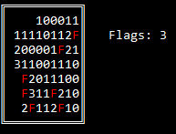

# Saper
Command line implementation of [Minesweeper (video game)](https://en.wikipedia.org/wiki/Minesweeper_(video_game))

## Gameplay
The objective of the game is to clear a rectangular board containing hidden bombs without detonating any of them. We can put flags on bombs for mark them.\
LMB – show field under mouse icon.\
RMB – put a flag.\

## Setup
It's already configured for Visual Studio 2017 (v141 toolset).